<!-- markdownlint-disable MD013 MD033 -->

# SCiO hardware reference

What is inside a SCiO pocket spectrometer, what each part does, and what is still
unknown about it. It combines a public teardown with what this project measured on
its own unit (firmware 147) over USB.

> **Photo credit.** Every photo in this document is by **SparkFun Electronics**, from
> ["SCiO Pocket Molecular Scanner Teardown"](https://learn.sparkfun.com/tutorials/scio-pocket-molecular-scanner-teardown-/all)
> by JOEL_E_B (2017). It is licensed
> [CC BY-SA 4.0](https://creativecommons.org/licenses/by-sa/4.0/) and reproduced
> unmodified from [`teardown/`](teardown/README.md). The photos are not covered by this
> repository's GPLv3. Reuse must credit SparkFun and keep the CC BY-SA 4.0 licence.
>
> The teardown unit is SparkFun's, not this project's. Part markings may differ between
> production batches.

**Contents**

1. [At a glance](#1-at-a-glance)
2. [Enclosure and user interface](#2-enclosure-and-user-interface)
3. [Main board](#3-main-board)
4. [Blackfin DSP (ADSP-BF512)](#4-blackfin-dsp-adsp-bf512)
5. [BLE / USB controller (CC2540F256)](#5-ble--usb-controller-cc2540f256)
6. [Optical sensor module](#6-optical-sensor-module)
7. [Firmware and where it may live](#7-firmware-and-where-it-may-live)
8. [Debug and test access](#8-debug-and-test-access)
9. [Open questions](#9-open-questions)
10. [Sources](#10-sources)

---

## 1. At a glance

| Function | Part | Notes |
|---|---|---|
| Signal processor | Analog Devices **ADSP-BF512KBCZ-3** Blackfin | 300 MHz, 168-ball BGA, 0-70 °C. **No on-chip program flash.** |
| Working memory | Alliance **AS4C8M16SA-7BCN** | 128 Mbit (16 MB) SDRAM, next to the DSP |
| Radio, USB, host link | TI **CC2540F256** | 8051 BLE SoC, 256 KB flash, full-speed USB, AES engine. Enumerates as `0451:16AA` |
| Battery charging | probably ADI **ADP5062** | Marking `5062 #1641`; not confirmed |
| Unidentified | two small QFNs | `LGQ #629`, `BDT 52W Z25K` |
| Sensor | custom module, flex by **Ichia** | 12 receptors in a 3 × 4 grid over one wire-bonded array, LED light source, driver IC `U2` |
| Power | LiPo battery, micro-USB charging | Charging LED on the board |

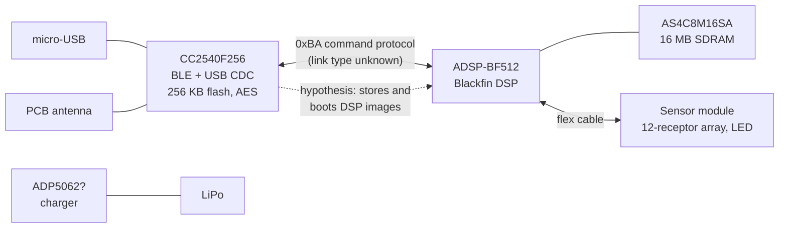
```mermaid
flowchart LR
    USB[micro-USB] --- CC[CC2540F256<br/>BLE + USB CDC<br/>256 KB flash, AES]
    ANT[PCB antenna] --- CC
    CC <-->|"0xBA command protocol<br/>(link type unknown)"| DSP[ADSP-BF512<br/>Blackfin DSP]
    DSP --- SDRAM[AS4C8M16SA<br/>16 MB SDRAM]
    DSP <-->|flex cable| SENS[Sensor module<br/>12-receptor array, LED]
    CHG[ADP5062?<br/>charger] --- BAT[LiPo]
    CC -. "hypothesis: stores and<br/>boots DSP images" .-> DSP
```

Solid lines are physical connections visible or required by function. The dotted line
is an unverified hypothesis ([§7](#7-firmware-and-where-it-may-live)).

---

## 2. Enclosure and user interface

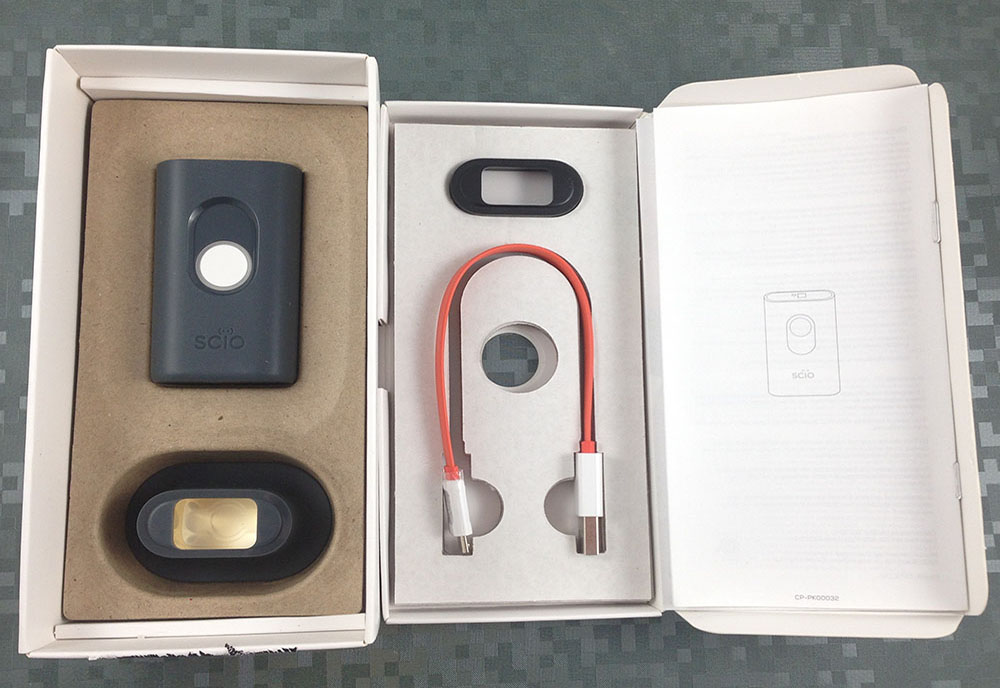 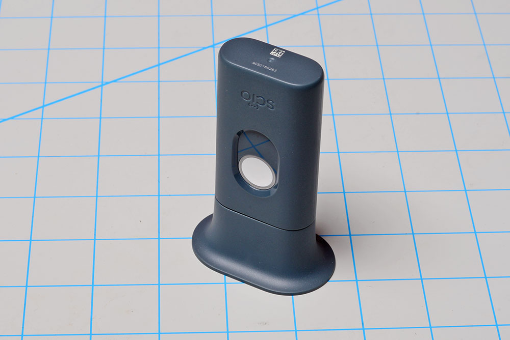

*Left: unboxing. Right: the SCiO on its stand, which doubles as the white-reference cover.
Photos: SparkFun Electronics, CC BY-SA 4.0.*

- One large button (power and scan) with a reverse-mounted LED behind it, a micro-USB
  port for charging and data, and a charging LED.
- The housing holds magnets that hold the device to its stand.
- The stand's white interior is where the white reference is taken (README §6).
- The enclosure is not designed to be reopened: SparkFun had to force the plastic shell
  apart. Inside, five screws in total hold the battery housing, PCB and sensor.
- LED behaviour seen by this project: steady blue means awake and answering commands; a
  slow pulse means idle or charging, with USB silent (README §1, §8).

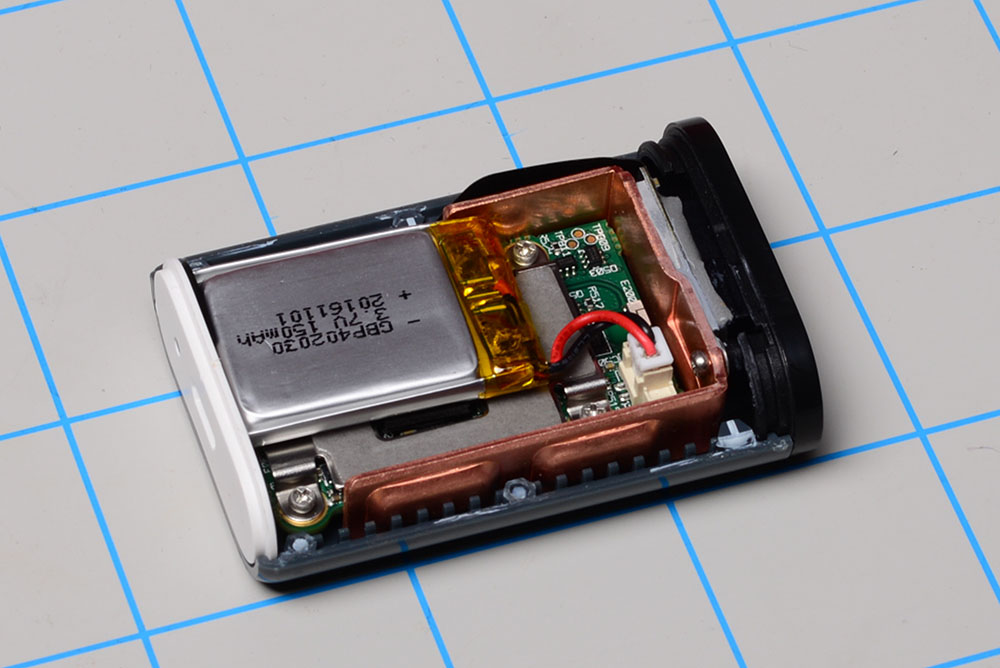 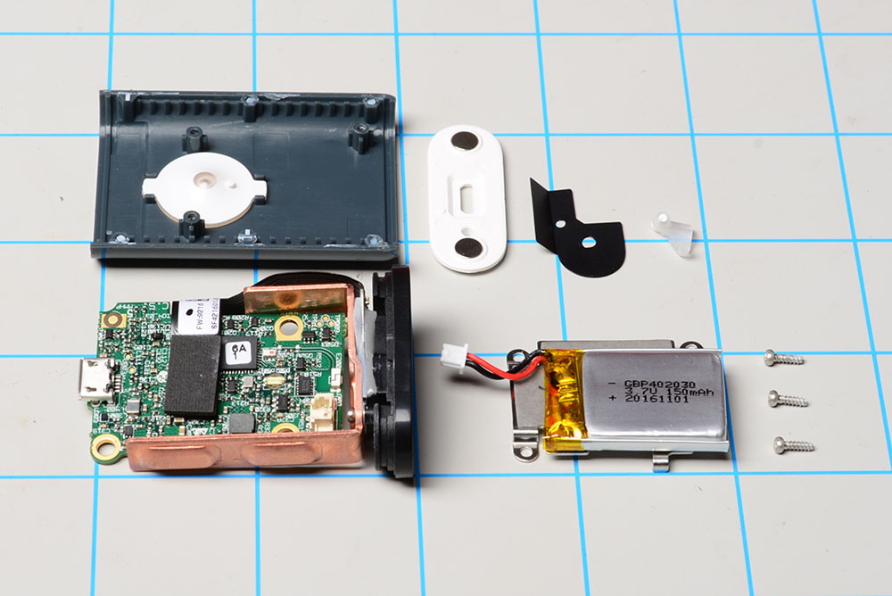

*Left: forcing the housing open. Right: the first layer: battery housing over the PCB.
Photos: SparkFun Electronics, CC BY-SA 4.0.*

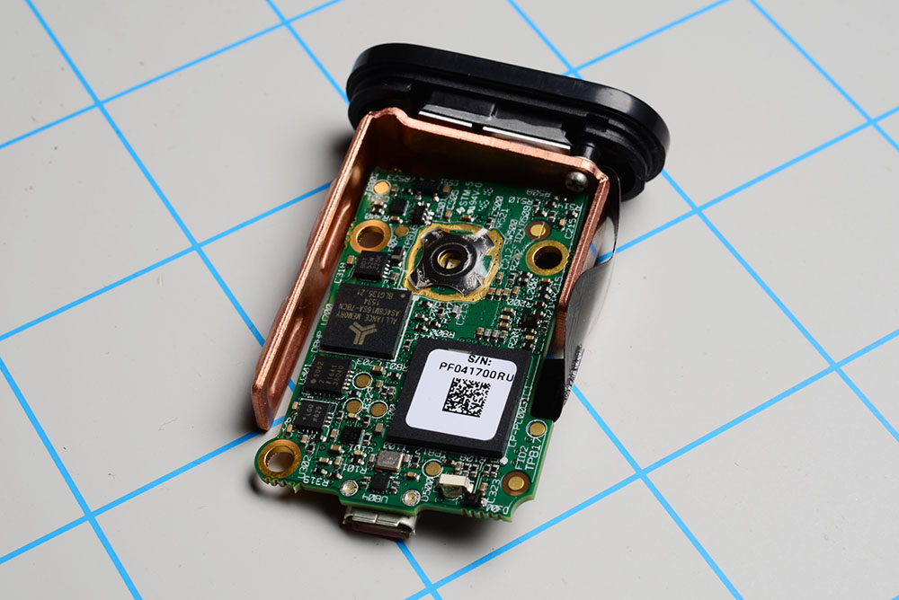

*A large copper heatsink wraps around the PCB and is bonded to the sensor with thermal
adhesive. The sensor connects to the board only through a flat-flex cable. Photo:
SparkFun Electronics, CC BY-SA 4.0.*

---

## 3. Main board

### Top side

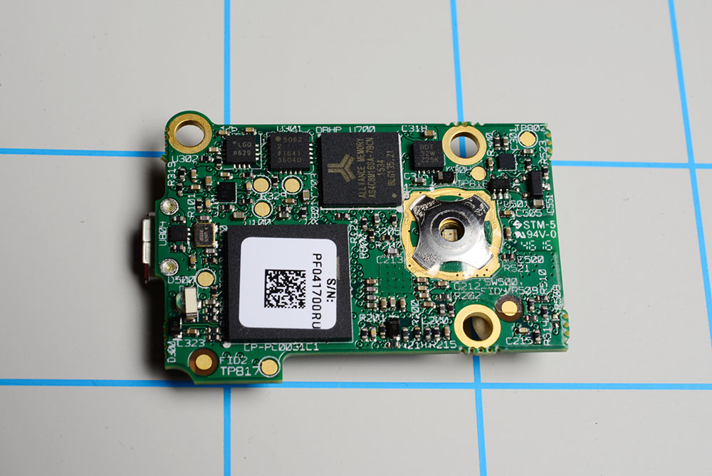

*Top side. The large square under the white "S/N" label is the BF512, and U700 to its
upper right is the SDRAM. Upper left are the QFNs `LGQ #629` and `U341` (`5062`), with
`BDT 52W Z25K` at upper right. The gold pads are test points (`TP8xx`), and four
castellated pads sit on the edge by `TP802`. Photo: SparkFun Electronics, CC BY-SA 4.0.*

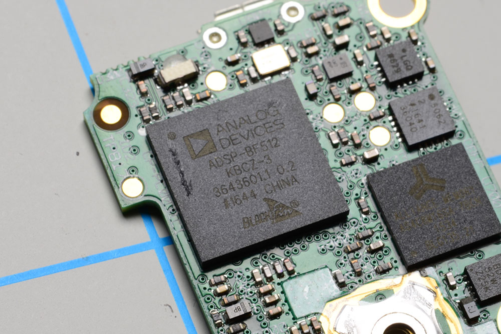

*The DSP with its label removed: `ANALOG DEVICES ADSP-BF512 KBCZ-3`, `3643601.1 0.2`,
`#1644 CHINA`. The SDRAM is on the right. Photo: SparkFun Electronics, CC BY-SA 4.0.*

### Bottom side

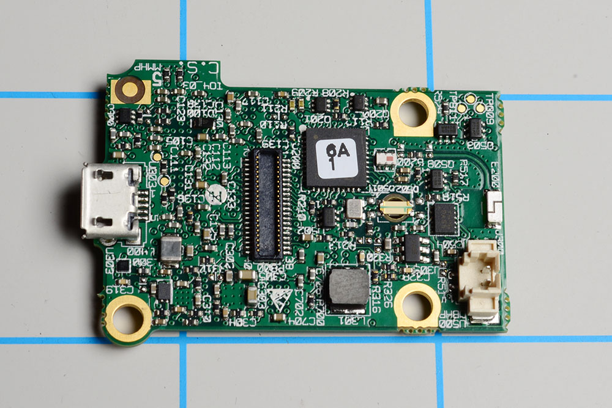 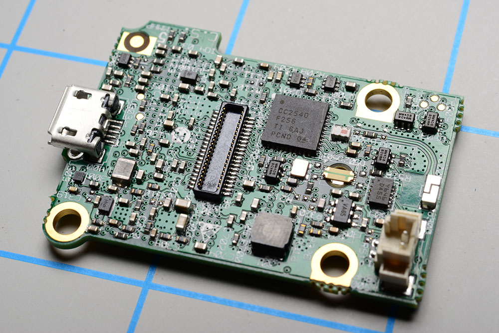

*Left: the bottom side with the sensor's board-to-board connector (centre), micro-USB
(left), battery connector (right) and the CC2540 under a hand-written "9A" label. Right:
the same side with the label removed: `CC2540 F256 TI 6AJ PCND G4`. Photos: SparkFun
Electronics, CC BY-SA 4.0.*

### Part markings

| Ref / place | Marking | Identification | Confidence |
|---|---|---|---|
| under S/N label | `ADSP-BF512 KBCZ-3 · 3643601.1 0.2 · #1644 CHINA` | ADSP-BF512KBCZ-3 | certain (ordering guide) |
| U700 | `ALLIANCE MEMORY AS4C8M16SA-7BCN 1534` | 128 Mbit SDRAM | certain |
| bottom, centre | `CC2540 F256 TI 6AJ PCND G4` | CC2540F256 | certain |
| U341 | `5062 2 #1641 36040` | ADP5062 Li-ion charger | probable (ADI-style date code) |
| next to U341 | `LGQ #629` | unknown | none |
| near C318 | `BDT 52W Z25K` | unknown | none |

No 8-pin SOIC/WSON part resembling a standalone SPI flash is visible on either face at
these photos' resolution (1000 px). This is a resolution-bounded observation, not proof
of absence.

The teardown also reports data-matrix contents: the DSP's S/N label (`PF041700RU/CP-PCA0031-C-7/…`),
the sensor flex (`SF421601JN/CP-MA00005-2-16/…`) and the plastic cover (`AC50160263`).
The top-side silkscreen reads `CP-PC0031C1`, close to the label's `CP-PCA0031-C`, and is
presumably the board's part number.

---

## 4. Blackfin DSP (ADSP-BF512)

Datasheet: [`adsp-bf512-514-516-518.pdf`](adsp-bf512-514-516-518.pdf) (Rev E; Rev D is
[`ADSP-BF512.pdf`](ADSP-BF512.pdf)).

- **Model:** ADSP-BF512KBCZ-3. That is commercial temperature (0-70 °C), 300 MHz,
  168-ball CSP_BGA. None of the nine BF512 models in the ordering guide has on-chip
  program flash. Rev E removes the obsolete 16 Mbit SPI-flash models.
- **Boot sources** are set by the BMODE2-0 strap pins and sampled at reset (datasheet
  Table 6):

  | BMODE | Boot source |
  |---|---|
  | `000` | idle, no boot |
  | `001` | external 8/16-bit parallel flash |
  | `011` | external SPI flash or EEPROM on SPI0 |
  | `100` | **SPI0 host**: the BF512 is a slave and another chip sends the LDR stream |
  | `101` | on-chip OTP: 2,560 B by default, at most 3,072 B |
  | `110` | SDRAM (warm boot) |
  | `111` | **UART0 host**: autobaud on `@`, then the host sends the stream |

  OTP cannot hold `dsp_op` (32,628 B), so at least that image comes from outside, possibly
  loaded by `dsp_boot` as a second stage.
- **Security:** Lockbox Secure Technology gives code authentication, a secure mode,
  private OTP and a unique chip ID. Whether SCiO uses it is unknown. If it does, keys may
  sit in private OTP that no external read reaches.
- **Debug:** IEEE 1149.1 JTAG with TCK, TMS, TDI, TDO, TRST and EMU. The package is a BGA,
  so no pins are reachable directly. Accessible test points have not been mapped.
- **Software view:** `READ_DEVICE_ID` reports a "DSP id" (README §3), and
  `READ_TEMPERATURE` word 1 is the DSP chip temperature.

---

## 5. BLE / USB controller (CC2540F256)

Datasheet: [`CC2540F256.pdf`](CC2540F256.pdf).

- **Role:** this chip's USB port is what the host sees. It enumerates as `0451:16AA`, "CP
  SCIO USB CDC", revision `0009`, with a single CDC-ACM interface. It also runs the BLE
  link (vendor GATT service `0x3490`, README §2). Both transports carry the same `0xBA`
  command protocol.
- **Resources:** 8051 core, 256 KB flash, full-speed USB, an AES coprocessor and a 2.4 GHz
  radio feeding the PCB antenna.
- **Firmware:** file 87, "BLE runtime" (119,233 B, version 125), is presumably its image.
- **Debug interface:** a proprietary two-wire protocol on **P2_1 = DD (pin 35)** and
  **P2_2 = DC (pin 34)**, plus RESET_N. It can erase and program the whole flash, halt the
  core and run instructions. Flash read-out is blocked when the debug-lock bit is set. The
  lock state of this product is **unknown**: it cannot be seen in photos or over USB.
  [`HARDWARE_ACQUISITION.md`](HARDWARE_ACQUISITION.md#teardown-photo-review-2026-10-04)
  describes the read-only check. **Never accept a chip-erase prompt.**

---

## 6. Optical sensor module

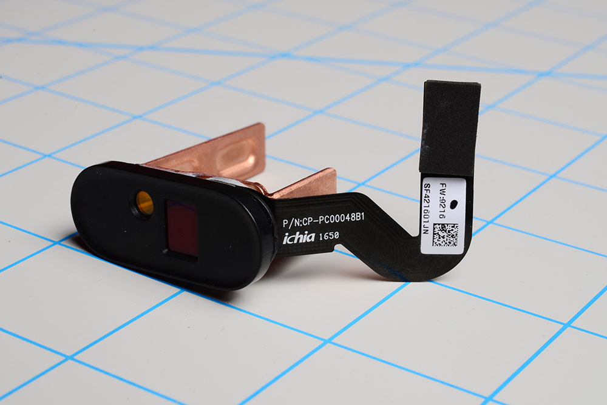 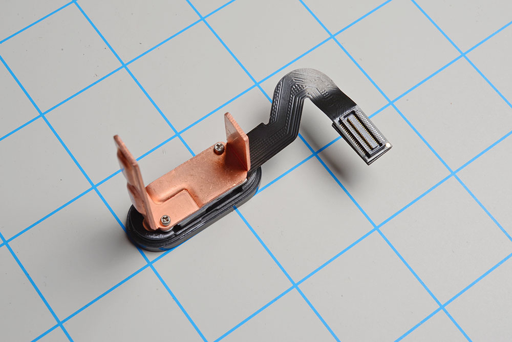

*Left: the sensor module on its heatsink. The flex is printed `P/N:CP-PC00048B1` and
`ichia 1650`, and carries a sticker `FW:9216` / `SF421601JN`. Right: the flex's
board-to-board connector. Photos: SparkFun Electronics, CC BY-SA 4.0.*

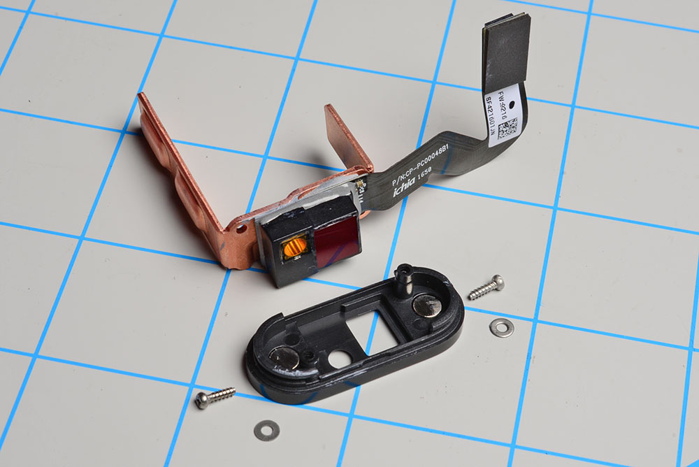 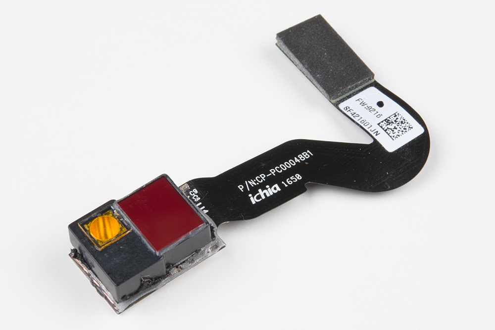

*Left: the module out of the front housing, with magnets and screws. Right: the module off
the heatsink, showing the LED window (amber) and the red-filtered sensor window. Photos:
SparkFun Electronics, CC BY-SA 4.0.*

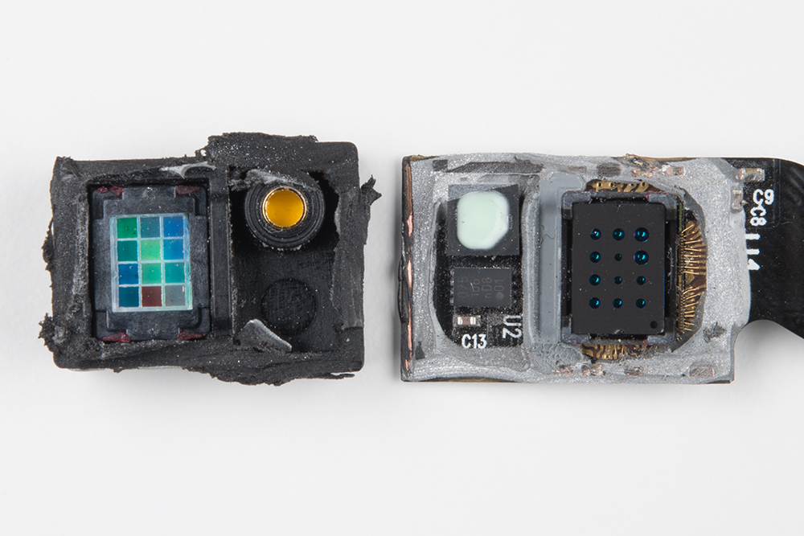

*Epoxy cut away. Left: the 3 × 4 filter array in its frame. Right: the light
source (pale square), its presumed driver IC `U2`, and the 12-aperture window over the wire-bonded sensor
die. Photo: SparkFun Electronics, CC BY-SA 4.0.*

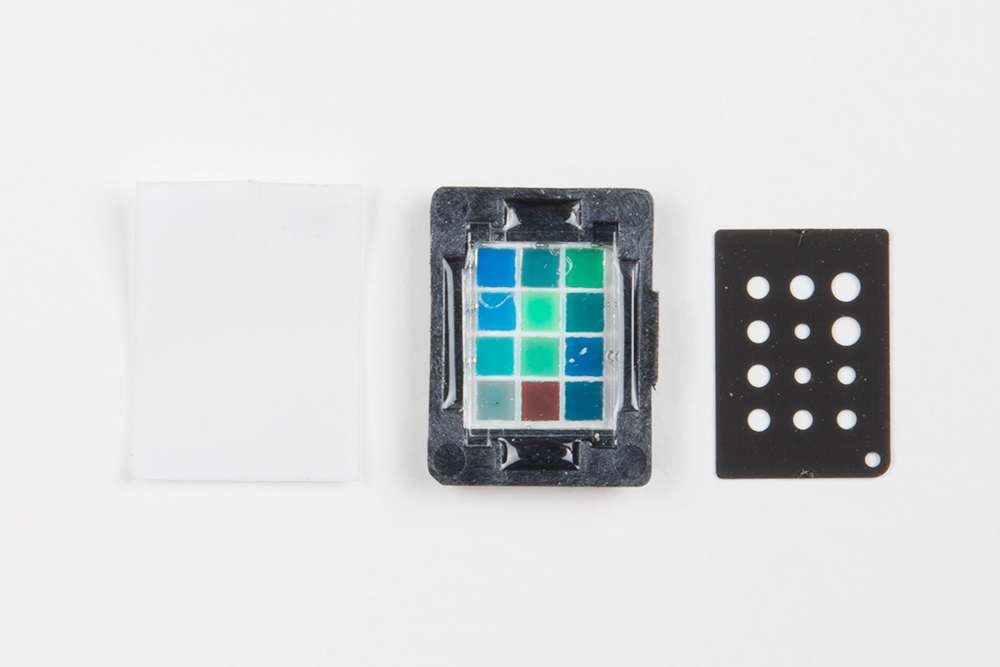 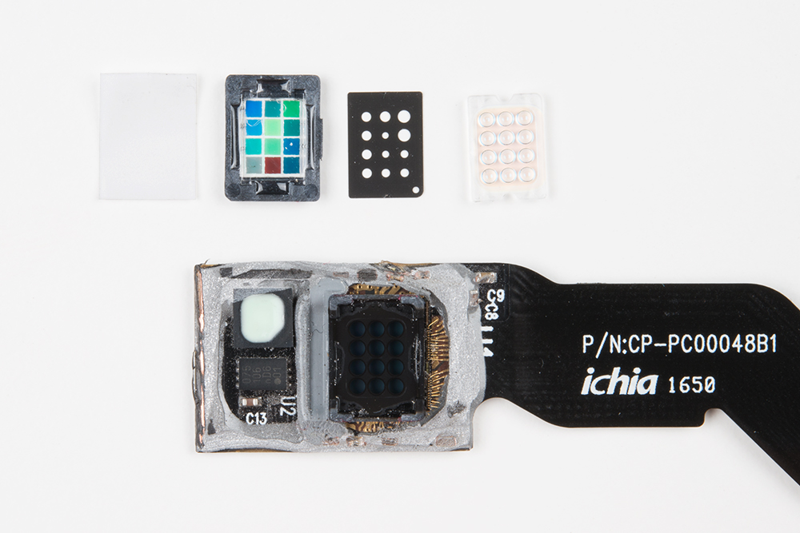

*Left: diffuser sheet, filter layer (12 visibly different filters) and aperture plate
(holes of differing size). Right: all layers, including the 12-lens array, beside the
module. Photos: SparkFun Electronics, CC BY-SA 4.0.*

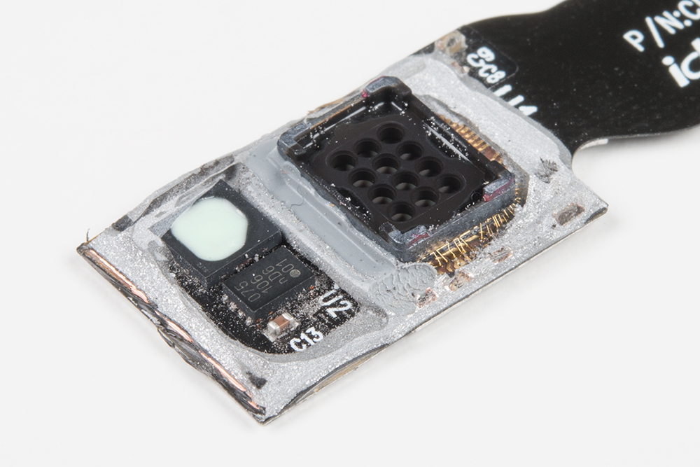

*Close-up of the 12-aperture window, the wire bonds, the LED and `U2`. Photo: SparkFun
Electronics, CC BY-SA 4.0.*

**Optical stack, top to bottom:** diffuser → 12-filter layer (3 × 4) → aperture plate →
12-lens array → one wire-bonded sensor die. An LED light source and a small IC `U2`, which SparkFun presumes controls it, sit beside it.

**What the software side adds:**

- `READ_DEVICE_ID` carries an **Aptina id**, and `READ_TEMPERATURE` word 0 is a **CMOS
  sensor** temperature (README §3). The die under the lenses is therefore very likely an
  Aptina CMOS image sensor, imaging 12 filtered sub-apertures. That is an inference from
  the names; the die is unmarked in the photos.
- The calibration tables `deadPixelsIndices`, `centers`, `bins` and `nPixelsPerBin` (README
  §5) fit a pixel-to-band binning step. `centers` (96 B) divides evenly into 12 × 8 B, one
  record per receptor, but nothing confirms that layout
  ([size constraints](../dev/analysis_output/size_constraints_20261004/size_constraints.json)).
- The output is 331 bands, 740-1070 nm.
- The sensor flex's own `FW:9216` sticker may identify a module firmware or calibration
  revision. Its meaning is unknown.

---

## 7. Firmware and where it may live

Files the unit reports over USB (`READ_FILE_HEADER`, README §5):

| File | Size | Likely runs on |
|---|---|---|
| 87 BLE runtime | 119,233 B | CC2540 |
| 90 `dsp_boot` | 7,284 B | BF512 (boot stage) |
| 91 `dsp_dec` | 14,600 B | BF512 |
| 92 `dsp_op` | 32,628 B | BF512 (version = device firmware 147) |
| 100-103 tables | 3,116 B together | binning/calibration data |

Only headers can be read over USB. `FILE_DOWNLOAD` writes and no read-back command
exists. Facts relevant to where the bodies are stored:

- The DSP has no program flash and OTP is too small, so `dsp_*` must come from external
  memory or from a host at boot.
- No standalone flash chip is visible in the photos.
- **All reported files together (176,861 B) fit in the CC2540's 256 KB flash**, and the
  CC2540 serves the file list, headers and `FILE_DOWNLOAD` itself.

**Hypothesis (unverified):** the CC2540 stores the DSP images and boots the BF512 in SPI0-
or UART0-host mode. If so, the decisive data sits behind the CC2540's debug lock. It would
also cross the CC2540-to-BF512 bus at every power-on, where a logic analyzer could record
it without unlocking anything.

---

## 8. Debug and test access

| Interface | Signals | Where on the board | Status |
|---|---|---|---|
| BF512 JTAG | TCK, TMS, TDI, TDO, TRST, EMU | BGA balls; test points unmapped | untested |
| BF512 boot bus | SPI0 (PG12-15) or UART0, per BMODE | unmapped | untested |
| CC2540 debug | DD = P2_1 (pin 35), DC = P2_2 (pin 34), RESET_N | no labelled header; four castellated edge pads by `TP802` are a candidate | lock state unknown |
| Test points | `TP8xx` gold pads | top side | functions unknown |

Mapping these needs the board in hand, unpowered, with a continuity meter. The procedure,
its safety rules (no writes, erases, resets or strap changes) and the order of routes are in
[`HARDWARE_ACQUISITION.md`](HARDWARE_ACQUISITION.md). The research to-do list is
[`../dev/HANDOVER.md`](../dev/HANDOVER.md).

---

## 9. Open questions

1. Which BMODE does the BF512 use, and what feeds its boot stream?
2. Is the CC2540's debug interface locked?
3. Which chip applies the opaque transform to scan data and the integrity check
   (`Bad_sample_signature`): BF512, CC2540, or neither?
4. Is Lockbox enabled on the BF512?
5. What are `LGQ #629`, `BDT 52W Z25K` and sensor `U2`, and is the sensor die an Aptina
   part?
6. What does the sensor flex's `FW:9216` sticker identify?

---

## 10. Sources

- SparkFun Electronics, JOEL_E_B, "SCiO Pocket Molecular Scanner Teardown",
  <https://learn.sparkfun.com/tutorials/scio-pocket-molecular-scanner-teardown-/all>,
  CC BY-SA 4.0. Photos, assembly description, part identifications and data-matrix
  contents.
- Analog Devices, ADSP-BF512/BF514/BF516/BF518 data sheet, Rev D and Rev E (this folder).
- Texas Instruments, CC2540F256 data sheet SWRS084F (this folder). Debug-command details
  are in TI's user guide SWRU191, which is not in the repository.
- This project's USB measurements on its own firmware-147 unit: README §2-§5,
  [`firmware_notes.md`](firmware_notes.md) and
  [`../dev/DEVICE_FUNCTION_REFERENCE.md`](../dev/DEVICE_FUNCTION_REFERENCE.md).
